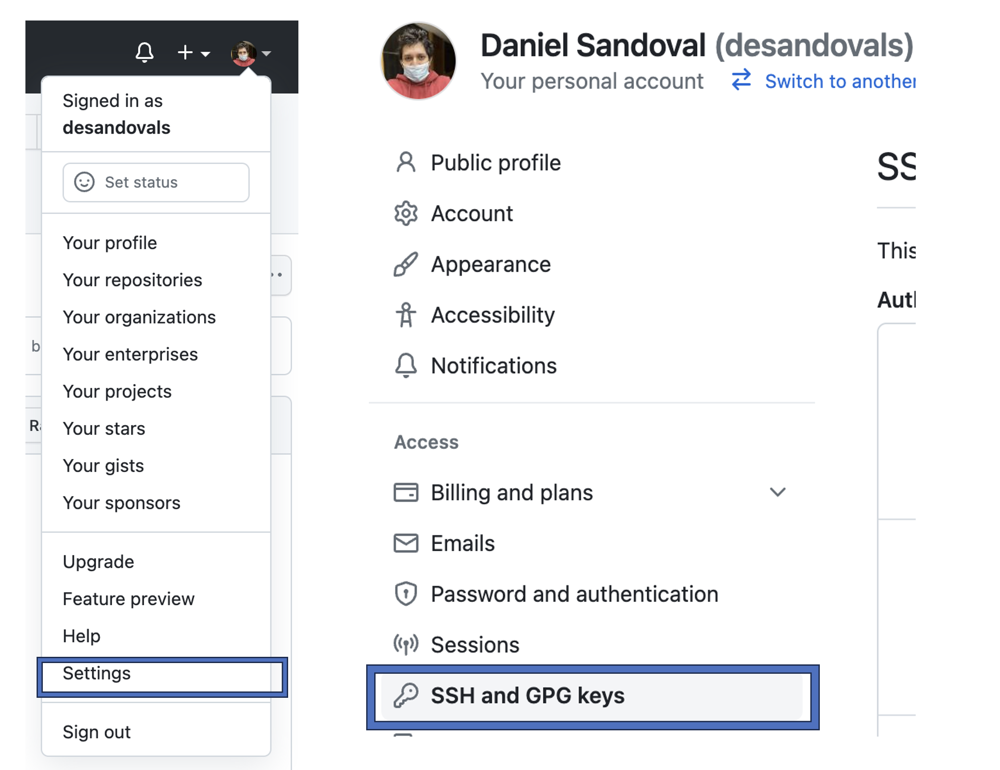

# Actividad # 1

## Instrucciones

Para la primer actividad, deberán cumplir lo siguiente: 

1. Tener <a href="https://code.visualstudio.com/" target="_blank">Visual Studio Code</a> instalado

2. Instalar <a href="https://code.visualstudio.com/" target="_blank">Google Cloud SDK </a>

3. Instalar <a href="https://github.com/git-for-windows/git/releases/download/v2.40.1.windows.1/Git-2.40.1-64-bit.exe" target="_blank">cliente GIT  </a>

4. Obtener usuario en <a href="https://github.com" target="_blank">GitHub </a>GitHub. 

5. Generar llave SSH en GitHub. 

Desde la terminal dentro de Visual Studio Code ejecutar: 

```
ssh-keygen -t rsa
```

6. Añadir llave SSH en usuario de GitHub

<p align="center">

</p>


7. Pasar la prueba de validación. 

```
ssh -T git@github.com
```


